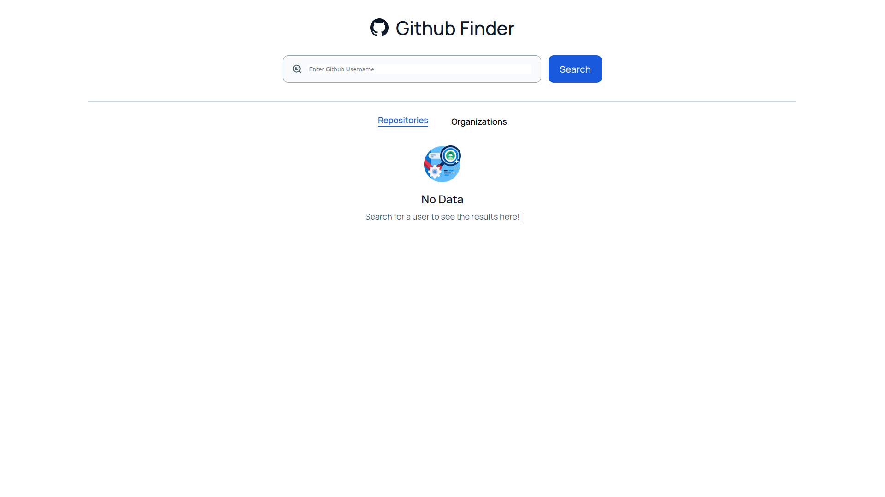

# [Github Finder](https://github-scout.netlify.app/). Find your github repositories

### Installation

**1. Clone the repository**

```sh
git clone 'https://github.com/rahulrajdahal/github_repos.git'
```

**2. Install Dependencies**

**npm**

```sh
npm install
```

**3. Run development server**

```sh
npm run dev
```

**OR**

**3. Run Production server**

```sh
npm run start
```

## Preview

[](https://github-scout.netlify.app/)

## 🚀 Project Structure

Inside of github finder, you'll see the following folders and files:

```text
/
├── public/
│   └── favicon.ico
├── src/
│   ├── components/
│   │   ├── Card
│   │   │   └── index.tsx
│   ├── assets/
│   │   ├── icons
│   │   │     └── arrow.svg
│   │   ├── images
│   │   │     └── arrow.png
|   ├── pages/
│   │   ├──  HomePage.tsx
│   │   │    └── index.tsx
│   └── redux/
│   │   ├── rootEpic.ts
│   │   ├── rootReducer.ts
│   │   └── store.ts
└── package.json
```

## 🧞 Commands

All commands are run from the root of the project, from a terminal:

| Command         | Action                                       |
| :-------------- | :------------------------------------------- |
| `npm install`   | Installs dependencies                        |
| `npm run dev`   | Starts local dev server at `localhost:3000`  |
| `npm run build` | Build your production site to `./build/`     |
| `npm run start` | Preview your build locally, before deploying |
